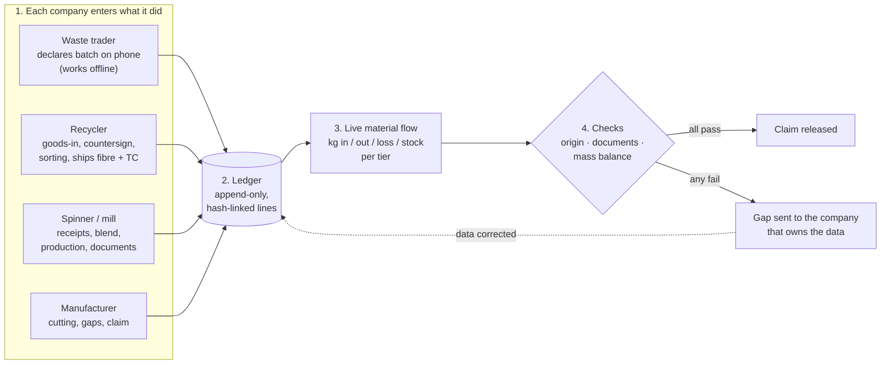

# Threadback in one page

**Threadback is a shared ledger of what happened to recycled material, written by the companies that handled it.** For every recycled content claim it answers three questions:

1. **Origin:** where did the material come from?
2. **Documentation:** who handled it, and do their documents agree?
3. **Mass balance:** do the kilograms add up from waste to garment?

The customer is the garment manufacturer. It invites its suppliers, and each tier invites the next one up, down to the waste trader.

## The four layers

### 1. Each company enters what it did

| Who | What they enter | Why it matters |
|---|---|---|
| Waste trader | For each batch: weight and weighbridge slip, source factories with kg and dates, colour and fibre sort, "no elastane, no prints", signature | This is where evidence usually breaks. The form is phone-first, in English and Bangla, and **works offline**. |
| Recycler | Goods-in weight at its gate (and moisture), **countersignature** of the trader's declaration, sorting and shredding runs, fibre shipments with TC | The first certified tier. It is the bridge between informal waste and certified fibre. |
| Spinner, mill | Receipts, blends (virgin cotton in), production runs, shipment documents | Where the recycled % is set and where kg are converted. |
| Manufacturer | Cutting and sewing, gaps, the claim | Owns the claim to the EU buyer. |

Every company sees its own records and its direct partners. The manufacturer sees the whole chain. Nobody sees prices.

### 2. Every entry becomes a line in the ledger

Nothing is ever overwritten. A change is a new line: *who, when, what happened, which records changed*. Each line's fingerprint (SHA-256) includes the previous line's fingerprint, so editing any past line breaks the chain from that point. **Check the chain** in the app proves it is intact. Current data is the replay of all lines.

### 3. The ledger becomes a live material flow

Kilograms moving tier by tier, with recycled kg inside, virgin cotton joining at the spinner, loss at each step and stock waiting at each tier. It updates on every connected screen the moment a line is added. Each company also has a mass-balance account in recycled kg: production adds credit, shipments and claims use it up, and credit can never go below zero.

### 4. Checks decide whether the claim can go out

- **Origin:** declaration complete and signed; every kg traced to a named factory; countersigned by the recycler at goods-in (and re-countersigned if the declaration changes).
- **Documents:** at every handoff, TC, PO, invoice, packing list and goods-in weight agree on parties, dates, quantity (±2%) and recycled % (±0.5 pt). Scope certificate valid and covering the product.
- **Mass balance:** yield plausible per process; declared recycled % supported by inputs; pieces × fabric per piece fits the fabric received; claim within ledger credit; GRS minimum 20% (logo at 50%).

A failing check becomes a **gap** sent to the company that owns the data. It closes on its own when the data is fixed. The claim is released only when every check back to the waste passes.

## Offline, precisely

A waste godown often has no signal. The app's files are cached on the phone (service worker). Every change runs on the phone at once and waits in an **outbox**. When the connection returns, the outbox is sent in order. Each change carries a unique id, so a retry is never written twice. If the server refuses a change (for example, someone else changed the batch), it is shown to the user to fix or discard, never silently dropped.

## How the code follows the concept

| Concept | Code |
|---|---|
| Commands (what a company can do) | `app/js/engine/commands.js`: same code on phone and server |
| Ledger (append-only, hash-linked) | `app/js/engine/ledgerlog.js`, stored in SQLite by `server/ledger.js` |
| Who sees what | `app/js/engine/visibility.js`, enforced on the server |
| Material flow | `app/js/engine/flow.js` |
| Checks and mass balance | `app/js/engine/checks.js`, `ledger.js`, `trace.js` |
| Offline outbox | `app/js/store.js`, `app/sw.js` |
